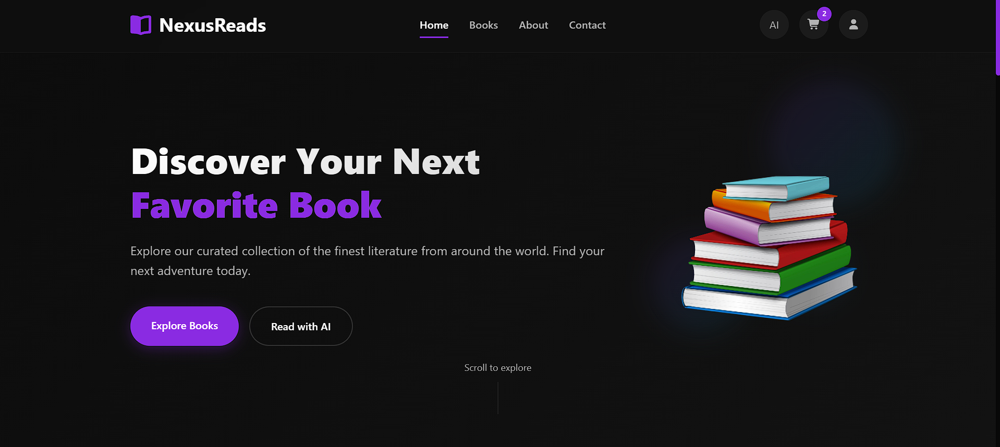
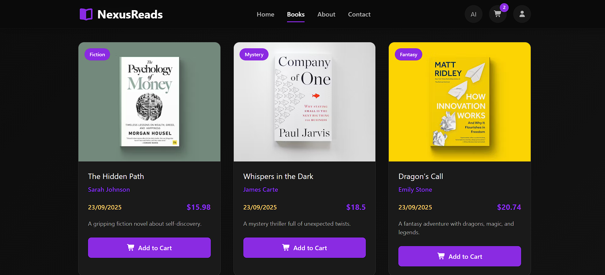
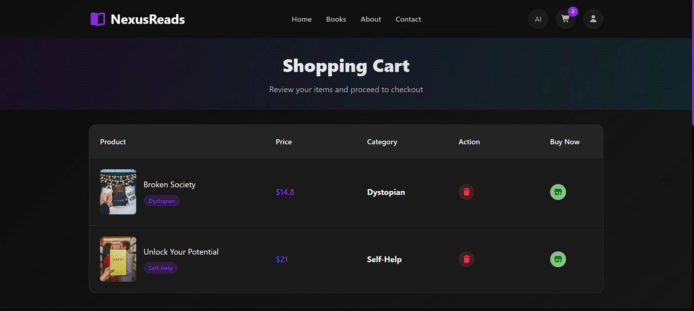
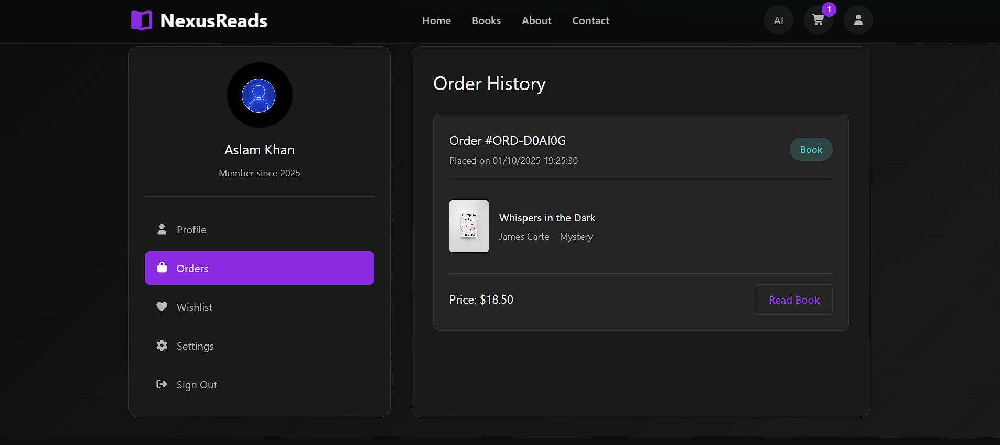
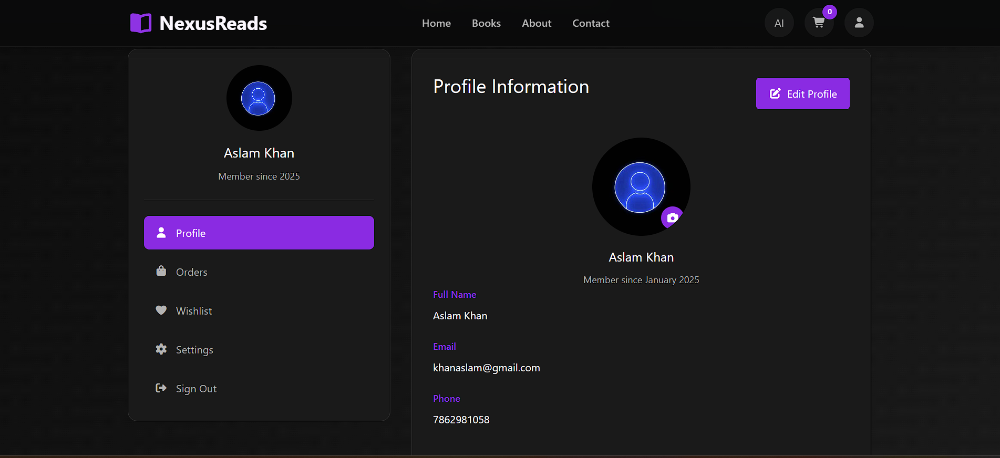
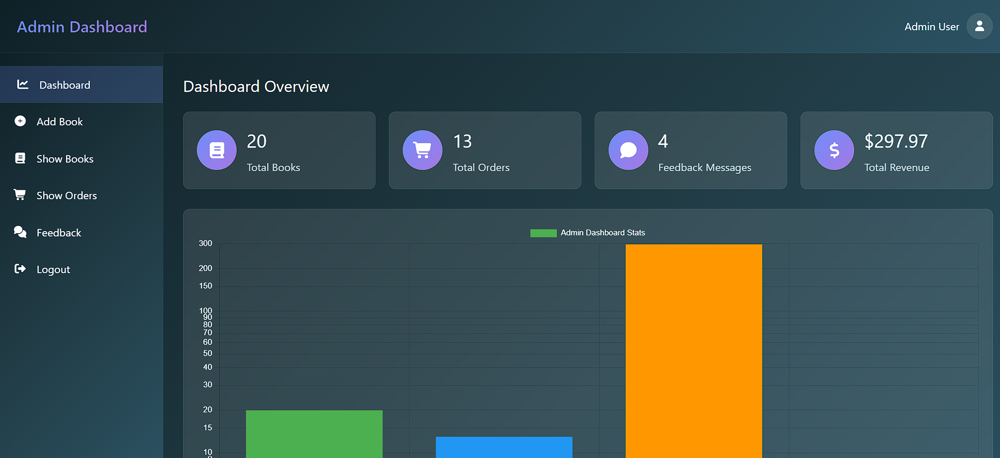

# 📚 Online Book Store

An Online Book Store web application built using the **MERN Stack** (MongoDB, Express.js, React, Node.js).  
It allows users to **browse, search, and purchase books**, while admins can **manage books and categories**.  

---

## 🚀 Features

### 👤 User Features
- 🔐 User authentication (Login / Signup / Logout)  
- 📖 Browse books by categories  
- 🔎 Search books by title, author, or category  
- 🛒 Add to cart & place orders  
- 👤 User profile with order history  

### 🛠️ Admin Features
- ➕ Add new books with images, descriptions, and categories  
- ✏️ Edit / Delete books  
- 📂 Manage categories  
- 📊 View all orders  

---

## 🏗️ Tech Stack

- **Frontend:** React.js, CSS Modules  
- **Backend:** Node.js, Express.js  
- **Database:** MongoDB (Mongoose)  
- **Authentication:** JWT (JSON Web Token)  
- **Image Uploads:** Multer  

---

## 📂 Project Structure

📦 Online-Book-Store  
   ┣ 📂 client : React Frontend  
   ┣ 📂 server : Node/Express Backend  
   ┣ 📂 screenshots : Uploaded book images  
   ┣ 📜 README.md  

---

## ⚙️ Installation & Setup

### 1️⃣ Clone the repository
```bash
git clone https://github.com/AslamKhanpathan/online-book-store-with-mern-stack.git
cd online-book-store-with-mern-stack
```
### 2️⃣ Setup Backend
```bash
cd server
npm install
```

Create a .env file inside server:

```bash
PORT=3000
MONGO_URI=your-mongodb-uri
JWT_SECRET=your-secret-key
```

Start the backend:
```bash
npm start
```
### 3️⃣ Setup Frontend
```bash
cd ../client
npm install
npm start
```

---

### 📌 Future Enhancements

-📱 Responsive Mobile App (React Native)

-💳 Online Payment Gateway

- Book Reviews & Ratings

-🔍 Advanced Search Filters

---


## 🚀 Live Demo  
👉 [Click Here to View Live Project](https://online-book-store-with-mern-stack.vercel.app/)  

---

## 📸 Screenshots  

### 🏠 Home Page  
  

### 🚚 Book Listing  
 

### 🛒 Add To Cart Page  
  

### 📖 Order Page
  

### 📖 Profile Page


### ⚙️ Admin Panel  
  

---

### 🧑 Author

**Aslam Khan**
 - 📧 Email: your-email@example.com

 - 🌐 GitHub: [My Github Account](https://your-live-demo-link.com)  


